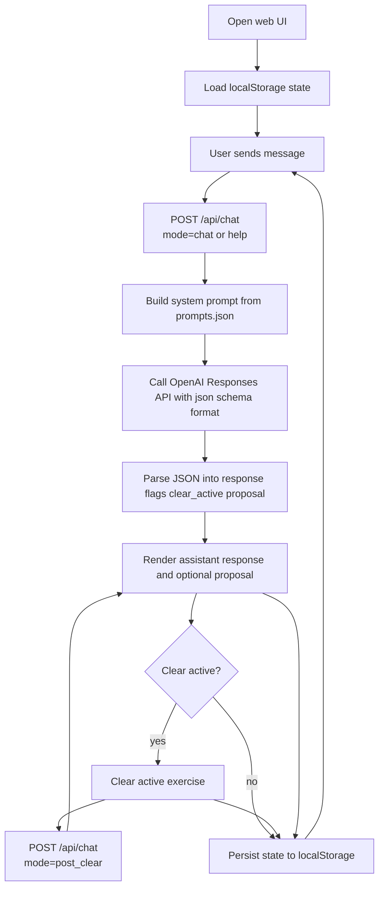
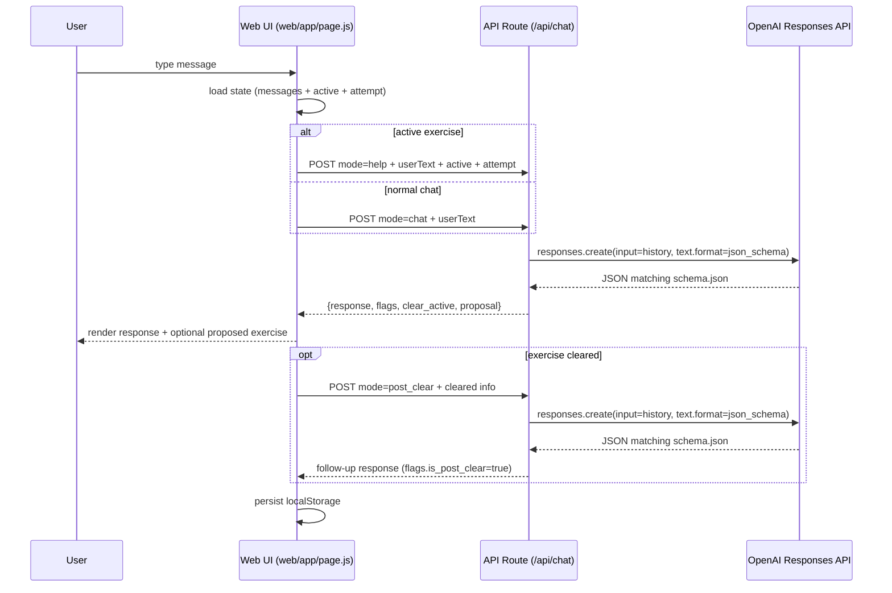

# Language

Single chatbot conversation that helps with learning second languages.

## Features

- **Single, infinite chatbot thread**
  - Treat the experience as one continuous conversation.
  - New user and assistant messages are appended to the same history.

- **Three core behaviors**
  - Chat with the user.
  - Propose an exercise when appropriate.
  - Help the user with an exercise when asked.

- **Memory of conversation**
  - Persist the message history so the thread can resume after refresh/reopen.
  - If the history becomes too large, summarize older messages into a compact context summary while keeping recent turns verbatim.

- **OpenAI-powered chat**
  - Build an OpenAI API request from:
    - a system instruction (target language, correction mode, tone), and
    - the current conversation history (plus optional summary).
  - Keep OpenAI API keys out of the repository; load them from environment variables or a local, untracked config.

- **Generated practice problems based on user's progress**
  - Track what the user has recently learned or struggled with (from the conversation and/or explicit progress metadata).
  - Generate short exercises (translation, fill-in-the-blank, free response) tailored to that context.
  - Store the user’s answers and feedback so future problems adapt.

- **Chatbot help on problems**
  - When an exercise is active, any user message is treated as a help request for that active exercise (no separate Help button).
  - In help mode, the model sees the active exercise and the user’s current work/attempt.
  - The model provides hints, explanations, corrections, and a suggested next step.

- **Programmable response flags**
  - Every assistant response includes `flags.is_help` and `flags.is_post_clear`.
  - These let the UI tell normal chat responses apart from exercise-help responses and post-clear follow-ups.

- **Post-clear follow-up**
  - When an exercise is cleared (manually, objectively, or by the model), the app triggers a follow-up model turn.
  - The follow-up response must set `flags.is_post_clear = true`.

- **Progress reports**
  - Maintain lightweight progress signals (e.g., accuracy by topic, recurring mistakes, vocabulary exposure).
  - Produce periodic progress reports summarizing strengths, weaknesses, and suggested next steps.

## Implementation

- **Runtime**
  - JavaScript/TypeScript.

- **Model API**
  - OpenAI API.

- **Structured Outputs contract**
  - The app uses OpenAI Structured Outputs so the model response is always valid JSON matching a schema.
  - Output is split into:
    - `response`: always present; the assistant message shown in the chat.
    - `flags`: always present; `{ is_help, is_post_clear }`.
    - `clear_active`: always present; `1` tells the app to clear the current active exercise.
    - `proposal`: always present; contains an `enabled` flag.
      - If `proposal.enabled` is `0`, there is no new exercise proposal and all `proposal` payloads are `null`.
      - If `proposal.enabled` is `1`, the app shows an exercise proposal UI in the chat.
  - Proposals are not automatically active: the user must click a “Start exercise” control to activate a proposal.
  - `proposal.problem_type` selects which per-type payload to show (`proposal.translation`, `proposal.fill_in_blank`, `proposal.multiple_choice`, `proposal.free_response`).
  - Non-selected payloads are set to `null`.

- **Prompting strategy**
  - Normal chat turns should decide whether to set `proposal.enabled` to `1`.
  - Exercise help turns happen whenever the user sends a message while an exercise is active.
  - After an exercise is cleared, the app triggers request mode `post_clear` so the assistant can continue the session.
  - Objective exercises (fill-in-blank and multiple choice) are graded by the app, not by the model.

- **Structured Outputs schema**
  - See `schema.json`.

- **Storage**
  - Web GUI state is stored in the browser via `localStorage`.
  - The legacy CLI stores state in `language_state.json`.

- **UI**
  - Web GUI (Next.js + Tailwind) under `web/`.
  - Legacy CLI (`cli.mjs`) is still available but is not the primary UI.

## How it works

This repo primarily implements a minimal web GUI (Next.js + Tailwind).

Key files:

- `.env`: holds `OPENAI_API_KEY` (and optionally `OPENAI_MODEL`).
- `schema.json`: Structured Outputs JSON Schema that the model must follow.
- `prompts.json`: model prompting templates, including help + post-clear modes.
- `web/app/page.js`: browser UI.
- `web/app/api/chat/route.js`: server-side OpenAI call.
- `cli.mjs`: legacy CLI entrypoint.
- `language_state.json`: legacy CLI persisted state.

High-level flow:



### State model

Web GUI (`localStorage`, key `language_web_state_v2`) stores:

- `config`: `nativeLanguage` + `targetLanguage`
- `messages`: chat history
- `active`: the currently active exercise (or `null`)
- `attempt`: the user's current attempt (shape depends on exercise type)

Legacy CLI (`language_state.json`) stores:

- `config`: `nativeLanguage` + `targetLanguage`
- `messages`: chat history

### Structured Outputs contract

Every model response must match `schema.json`:

- `response`: the chat reply to print.
- `flags`: always present.
  - `flags.is_help = true` only when answering a help request for an active exercise.
  - `flags.is_post_clear = true` only for the follow-up turn immediately after an exercise was cleared.
- `clear_active`: always present.
  - When the active exercise should be cleared, the model sets `clear_active = 1`.
  - Otherwise, `clear_active = 0`.
- `proposal`: always present and always has all required fields.
  - When no exercise is being proposed, the model sets `proposal.enabled = 0` and all per-type payloads are `null`.
  - When an exercise is proposed, the model sets `proposal.enabled = 1`, sets `proposal.problem_type`, and fills exactly one payload (`translation`, `fill_in_blank`, `multiple_choice`, or `free_response`).

### Request modes

Normal chat (`mode=chat`):

- The app sends the user text plus recent conversation turns.
- The model may set `proposal.enabled = 1` to propose a new exercise.

Exercise help (`mode=help`):

- The app includes the current active exercise plus the user's attempt.
- For objective exercises, answer keys are redacted from the model context.
- The prompt instructs the model to help with the current exercise only (hints/corrections/next step) and not propose a new one.

Post-clear follow-up (`mode=post_clear`):

- Triggered by the app immediately after an exercise is cleared.
- The prompt instructs the model to continue the session and set `flags.is_post_clear = true`.



## CLI

Prerequisites:

- Node.js 18+
- Create a `.env` file with `OPENAI_API_KEY`

The CLI is legacy and is not the primary UI.

Run (legacy):

```sh
npm install
npm run cli:legacy
```

Optional:

- `OPENAI_MODEL` (defaults to `gpt-5-mini`)

## Web GUI

The repository also includes a minimal web GUI (Next.js + Tailwind) under `web/`.

Notes:

- The browser UI does **not** get your API key. OpenAI requests are made server-side via `web/app/api/chat/route.js`.
- The web app uses the repo-level `schema.json` and `prompts.json`.
- Chat + exercise state is persisted in the browser via `localStorage`.

Run:

```sh
npm --prefix web install
npm start
```

Then open:

- `http://localhost:3000`